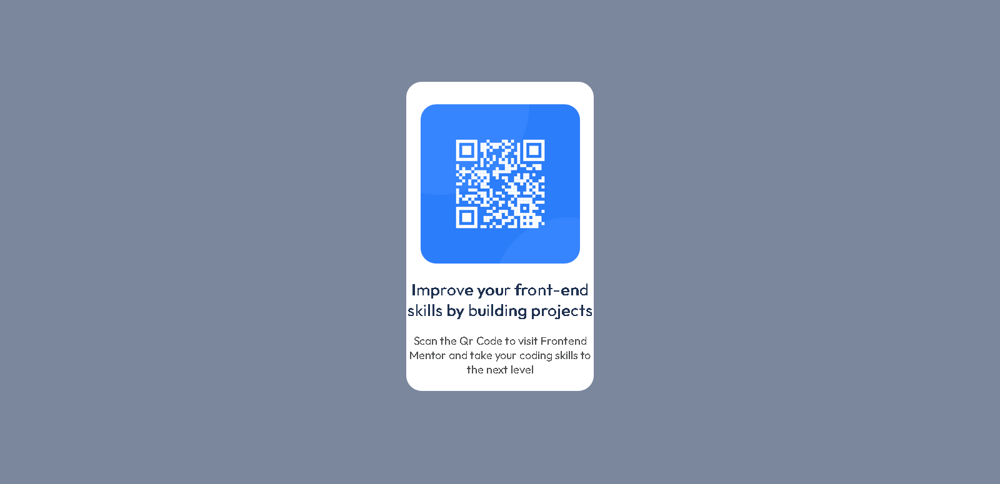

# Frontend Mentor - QR code component solution

This is a solution to the [QR code component challenge on Frontend Mentor](https://www.frontendmentor.io/challenges/qr-code-component-iux_sIO_H). Frontend Mentor challenges help you improve your coding skills by building realistic projects. 

## Table of contents

- [Overview](#overview)
  - [Screenshot](#screenshot)
  - [Links](#links)
- [My process](#my-process)
  - [Useful resources](#useful-resources)
- [Author](#author)

## Overview

### Screenshot

### Links

- Solution URL: [Solution](https://www.frontendmentor.io/solutions/qr-code-component-with-html-and-css-41-ZSb0H7K)
- Live Site URL: [Live Site](https://magrid0.github.io/QR-code-component/)

## My process

### Useful resources

- [StackOverflow](https://stackoverflow.com/questions/396145/how-can-i-vertically-center-a-div-element-for-all-browsers-using-css#6182661) - This helped me to center the qr code image and the other elements.

## Author

- Website - [Magrid0](https://magrid.altervista.org)
- Frontend Mentor - [@Magrid0](https://www.frontendmentor.io/profile/Magrid0)
